# TD : Créer une API qui stocke des données (Node.js + Express)
**Niveau :** Intermédiaire  
**Durée estimée :** 45 - 60 minutes

---

## 🎯 Objectif
Nous allons créer une application plus avancée. Au lieu de simplement afficher des données, notre serveur va :
1.  **Importer** des données depuis une API externe (Google/JSONPlaceholder).
2.  **Stocker** ces données dans un fichier local (`base_de_donnees.json`) sur votre ordinateur.
3.  **Relire** ce fichier pour afficher les données.

C'est le principe de base d'une base de données !

---

## 1. Architecture de l'application

Voici un schéma visuel pour comprendre comment les données circulent entre votre navigateur, votre serveur, le fichier sur votre disque et l'API externe.

```mermaid
graph TD
    subgraph "Votre Ordinateur (Localhost)"
        Browser["🖥️ Navigateur (Client)<br>(index.html + JS)"]
        Node["⚙️ Serveur Node.js<br>(app.js)"]
        File[("📁 Fichier Local<br>(users.json)")]
    end

    Internet["☁️ Internet<br>(API JSONPlaceholder)"]

    %% Flux 1 : Importation
    Browser -- "1. Clic 'Importer'" --> Node
    Node -- "2. Demande données" --> Internet
    Internet -- "3. Envoie données" --> Node
    Node -- "4. Écrit fichier" --> File

    %% Flux 2 : Lecture
    Browser -- "5. Clic 'Lire'" --> Node
    Node -- "6. Lit fichier" --> File
    File -- "7. Contenu JSON" --> Node
    Node -- "8. Affiche données" --> Browser

    style Browser fill:#e1f5fe,stroke:#01579b
    style Node fill:#e8f5e9,stroke:#2e7d32
    style File fill:#fff9c4,stroke:#fbc02d
    style Internet fill:#f3e5f5,stroke:#7b1fa2
```



### Explication détaillée des flux :

1.  **Flux d'Importation (Bouton 1)** :
    *   Le navigateur envoie une commande au serveur (`/api/importer`).
    *   Le serveur joue le rôle de "client" et va chercher les données sur Internet (API JSONPlaceholder).
    *   Une fois reçues, le serveur **sauvegarde** ces données dans un fichier `users.json` sur votre disque dur.
2.  **Flux de Lecture (Bouton 2)** :
    *   Le navigateur demande les données (`/api/utilisateurs`).
    *   Le serveur **lit** simplement le fichier `users.json` local (il n'a plus besoin d'Internet).
    *   Le serveur renvoie les données au navigateur pour qu'elles soient affichées.

---

## 2. Préparation du projet

### Étape 1 : Initialisation
Créez un dossier `mon-api-stockage`, ouvrez-le avec VS Code.

Dans le terminal :
```bash
npm init -y
npm install express
```

---

## 3. Organisation du Code (Routes séparées)

Pour rendre notre application professionnelle et facile à maintenir (architecture modulaire), nous n'allons pas tout écrire dans `app.js`.
Nous allons séparer la logique des routes dans un fichier à part. C'est une première étape vers une architecture "microservices".

### Étape 1 : Le fichier de routes
1.  Créez un dossier nommé `routes` à la racine.
2.  Dans ce dossier, créez un fichier `utilisateurs.js`.

Copiez ce code dans `routes/utilisateurs.js` :

```javascript
const express = require('express');
const router = express.Router(); // On crée un "mini-routeur"
const fs = require('fs').promises;

const FICHIER_DONNEES = 'users.json';

// --- ROUTE 1 : IMPORTER (/api/importer) ---
// Notez qu'on utilise "/" ici, car le préfixe "/api" sera défini dans app.js
router.get('/importer', async (req, res) => {
    try {
        console.log("1. Récupération des données externes...");
        const reponse = await fetch('https://jsonplaceholder.typicode.com/users');
        const utilisateurs = await reponse.json();

        console.log("2. Sauvegarde dans le fichier...");
        await fs.writeFile(FICHIER_DONNEES, JSON.stringify(utilisateurs, null, 2));

        res.send(`Succès ! ${utilisateurs.length} utilisateurs sauvegardés.`);
    } catch (error) {
        console.error(error);
        res.status(500).send("Erreur lors de l'importation.");
    }
});

// --- ROUTE 2 : LIRE (/api/utilisateurs) ---
router.get('/utilisateurs', async (req, res) => {
    try {
        try {
            await fs.access(FICHIER_DONNEES);
        } catch {
            return res.json([]);
        }

        const data = await fs.readFile(FICHIER_DONNEES, 'utf-8');
        res.json(JSON.parse(data));
    } catch (error) {
        console.error(error);
        res.status(500).send("Erreur de lecture.");
    }
});

// On exporte le routeur pour pouvoir l'utiliser dans app.js
module.exports = router;
```

### Étape 2 : Le Serveur Principal (`app.js`)

Maintenant, `app.js` devient très simple. Son seul travail est de configurer le serveur et de charger les routes.

Modifiez le fichier `app.js` :

```javascript
const express = require('express');
const app = express();

// 1. Importation de nos routes
const utilisateursRoutes = require('./routes/utilisateurs');

// 2. Configuration
app.use(express.static('public'));

// 3. Utilisation des routes
// On dit : "Pour toutes les adresses commençant par /api, utilise le fichier utilisateursRoutes"
app.use('/api', utilisateursRoutes);

// 4. Démarrage
app.listen(3000, () => {
    console.log('Serveur lancé sur http://localhost:3000');
});
```

---

## 4. L'Interface (HTML + JS)

Créez un dossier `public` et dedans un fichier `index.html`.

```html
<!DOCTYPE html>
<html lang="fr">
<head>
    <meta charset="UTF-8">
    <title>Mon Stockage de Données</title>
    <style>
        body { font-family: sans-serif; padding: 20px; max-width: 800px; margin: 0 auto; }
        .actions { display: flex; gap: 10px; margin-bottom: 20px; }
        button { padding: 10px 20px; cursor: pointer; background: #007bff; color: white; border: none; border-radius: 5px; }
        button:hover { background: #0056b3; }
        button.secondary { background: #28a745; }
        
        .status { padding: 10px; background: #e9ecef; border-radius: 5px; margin-bottom: 20px; }
        
        .user-item { border-bottom: 1px solid #eee; padding: 10px 0; }
        .user-item strong { color: #333; }
    </style>
</head>
<body>

    <h1>Gestion des Utilisateurs</h1>

    <div class="actions">
        <button onclick="importerDonnees()">1. Importer & Sauvegarder (Serveur)</button>
        <button class="secondary" onclick="afficherDonnees()">2. Lire mes données locales</button>
    </div>

    <div id="status" class="status">En attente d'action...</div>

    <div id="liste"></div>

    <script>
        const statusDiv = document.getElementById('status');
        const listeDiv = document.getElementById('liste');

        // Action 1 : Demander au serveur de télécharger et stocker les données
        async function importerDonnees() {
            statusDiv.textContent = "Importation en cours...";
            try {
                const res = await fetch('/api/importer');
                const message = await res.text();
                statusDiv.textContent = message;
                statusDiv.style.backgroundColor = "#d4edda"; // Vert clair
            } catch (err) {
                statusDiv.textContent = "Erreur lors de l'importation.";
                statusDiv.style.backgroundColor = "#f8d7da"; // Rouge clair
            }
        }

        // Action 2 : Demander au serveur de lire le fichier local
        async function afficherDonnees() {
            statusDiv.textContent = "Lecture du fichier local...";
            listeDiv.innerHTML = "";
            
            try {
                const res = await fetch('/api/utilisateurs');
                const users = await res.json();

                if (users.length === 0) {
                    statusDiv.textContent = "Aucune donnée locale trouvée. Cliquez sur Importer d'abord !";
                    return;
                }

                statusDiv.textContent = `Lecture terminée : ${users.length} utilisateurs trouvés dans le fichier JSON.`;

                users.forEach(user => {
                    const div = document.createElement('div');
                    div.className = 'user-item';
                    div.innerHTML = `<strong>${user.name}</strong> - ${user.email} (Ville: ${user.address.city})`;
                    listeDiv.appendChild(div);
                });

            } catch (err) {
                console.error(err);
                statusDiv.textContent = "Erreur lors de l'affichage.";
            }
        }
    </script>
</body>
</html>
```

---

## 5. Tester le fonctionnement

1.  Lancez le serveur : `node app.js`
2.  Allez sur `http://localhost:3000`
3.  **Test 1** : Cliquez sur "Lire mes données locales".
    *   *Résultat attendu* : "Aucune donnée locale trouvée", car le fichier `users.json` n'existe pas encore.
4.  **Test 2** : Cliquez sur "Importer & Sauvegarder".
    *   *Résultat attendu* : "Succès ! 10 utilisateurs sauvegardés...".
    *   *Vérification* : Regardez dans votre dossier VS Code, un fichier `users.json` est apparu !
5.  **Test 3** : Cliquez à nouveau sur "Lire mes données locales".
    *   *Résultat attendu* : La liste des utilisateurs s'affiche.

---

## 6. Exercice Bonus

Ajoutez un formulaire simple dans le HTML (Nom, Email) et créez une route `POST /api/ajouter` dans `app.js` pour ajouter un nouvel utilisateur à votre fichier `users.json`.
*Indice : Il faudra lire le fichier, ajouter l'objet au tableau, et réécrire le fichier.*
